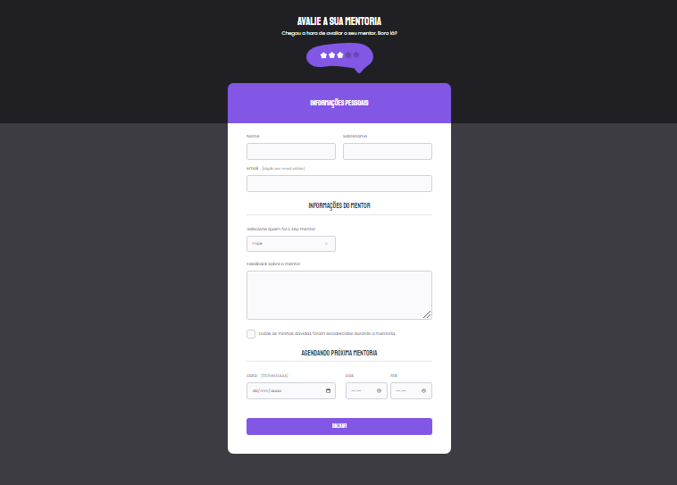

# Formulário avançado 

> Trilha Explorer

Finalizei o desafio do formulário avançado da Rocketseat, ficou muito lindo, tive uma ideia de usar as próprias cores da logo da Rocketseat nesse formulário, pois a gente poderia alterar cores e adicionar mais campos se quisessemos. Adicionei responsividade e animações que deu um toque super bacana. Nesse módulo de formulários eu aprendi a fazer um checkbox customizado e acessível, mudar backgrounds de campos, validações e muito mais.

[🔗 Clique aqui para acessar](https://filipesantos07.github.io/Rocketseat-desafio-formulario-avancado/)

## 🛠️ Tecnologias

- HTML
- CSS

## 💛 Contato

FilipeSantosEstudos1@gmail.com